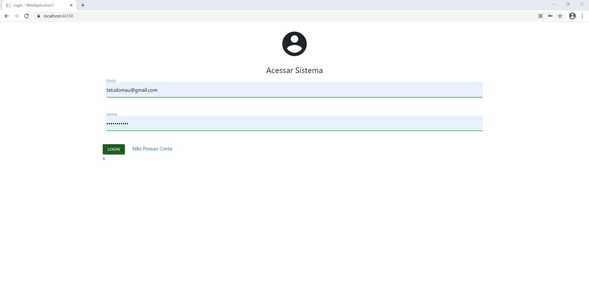
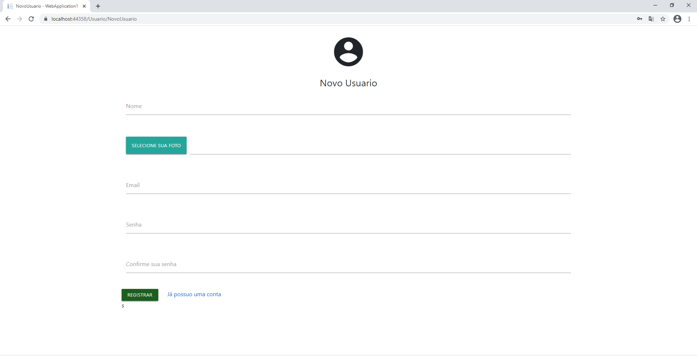
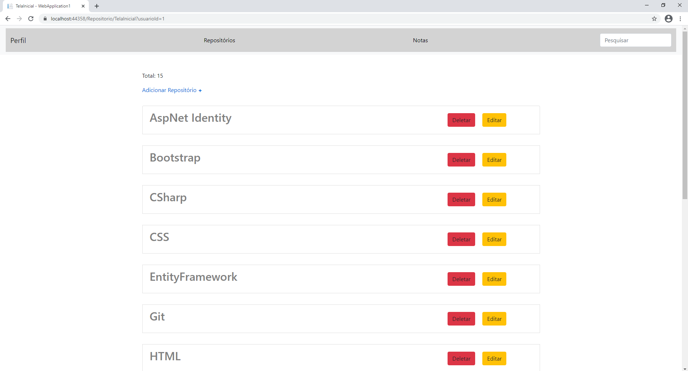
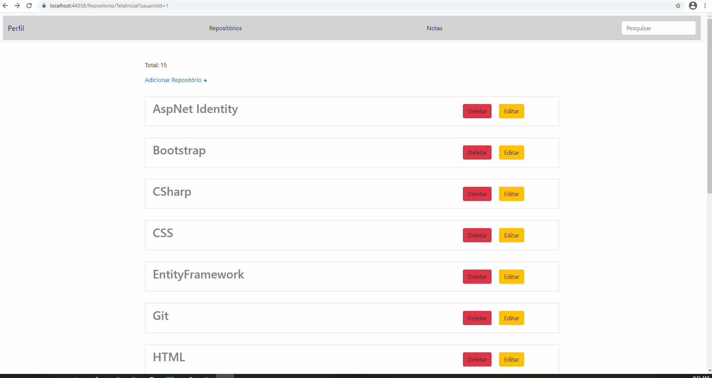
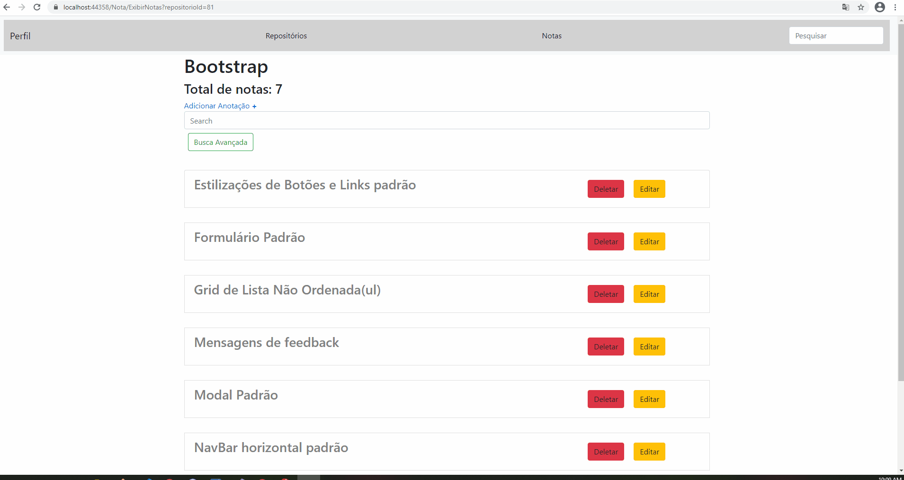
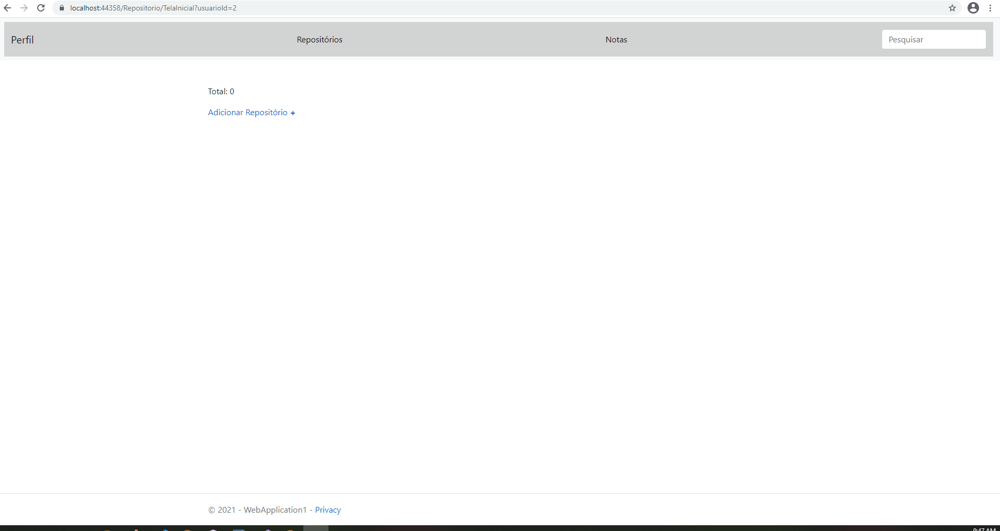
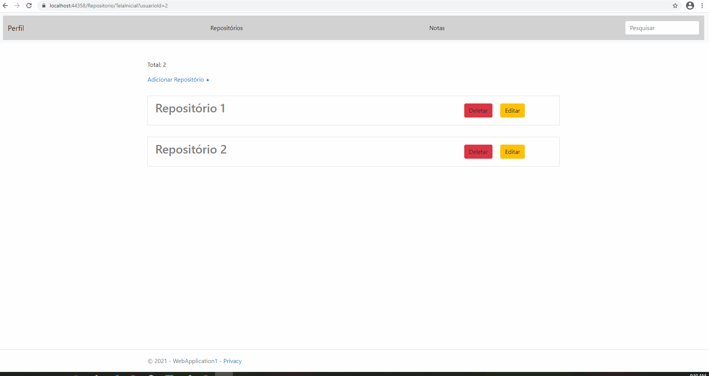
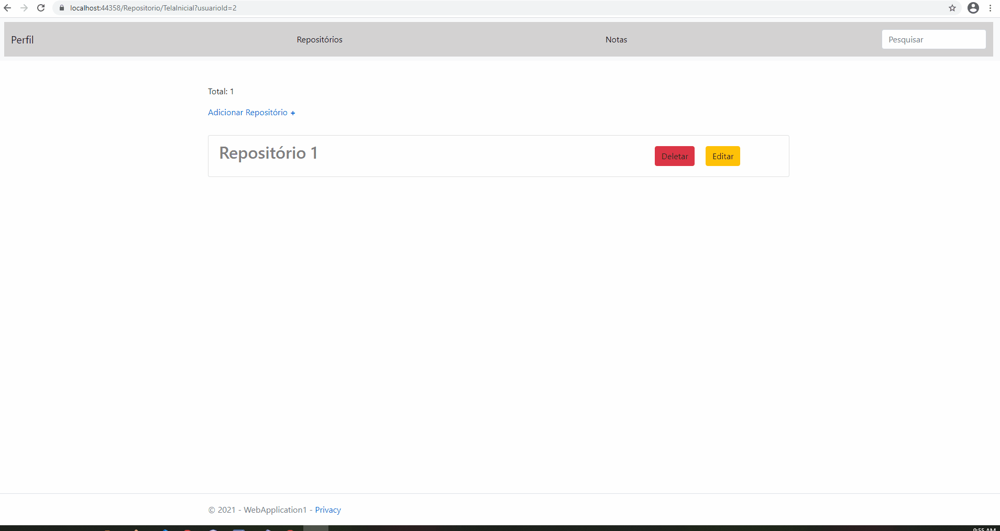
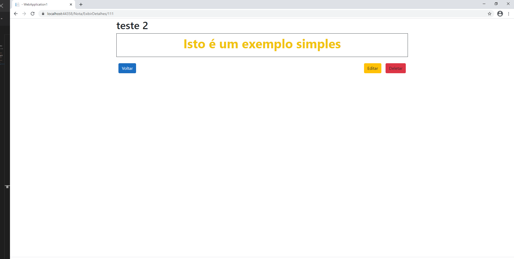
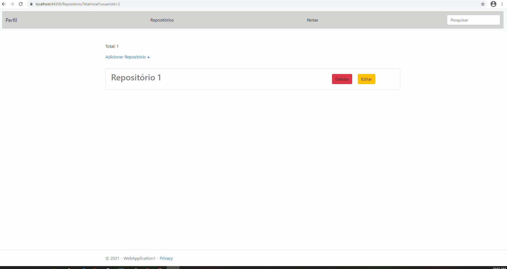

<h1 style="text-align: center;">Repositório Pessoal</h1>

<h2>🚀 Tecnologias</h2>
<ul>
    <li>HTML</li>
    <li>CSS
        <ul>
            <li>Boostrap</li>
        </ul>
    </li>
    <li>Javascript
        <ul>
            <li>Jquery</li>
        </ul>
    </li>
    <li>AspNetCore</li>
    <li>EntityFrameworkCore</li>
    <li>SqlServer</li>
</ul>

<h2>📝 Como Utilizar</h2>

Após feito o Clone, é preciso que tenha .Net Core 3.1 instalado em sua máquina e <a href="https://www.microsoft.com/pt-br/sql-server/sql-server-downloads">SqlServer</a>, caso queira somente rodar o programa basta baixar o Runtime! Tanto a versão SDK(para desenvolvimento) quando o Runtime estão disponíveis em:
    <a href="https://dotnet.microsoft.com/download">https://dotnet.microsoft.com/download</a>
    Também será necessário alterar a chave de conexão no arquivo: <a href="./WebApplication1/appsettings.json">appsettings.json</a>, alterando a chave ConexaoBD, para a cahve de conexão de seu banco de dados!

<h2>💻 Projeto</h2>

Repositório Pessoal é uma aplicação com finalidade de facilitar seu estudo. Tornando simples a anotação, organização e busca de registros! É possível criar um repositório para gravar anotações especificas, edita-las e formata-las da forma como desejar!

<h4>Tela de Login</h4>

Ao acessar o sistema, a tela inicial é a de login, caso o usuário não estja cadastrado no sistema é possível também que ele de cadastre clicando em "Não Possuo Cadastro"!

<h4>Tela de Cadastro</h4>

Preenchendo os campos corretamente, o usuário é adicionado ao sistema! 

<h4>Repositórios</h4>

Nesta imagem temos um pefil com 15 repositórios já criados!

<h4>Navegação Repositórios Para Notas</h4>

Estamos procurando em nossos repositórios o repositório com o assunto "BOOSTRAP", entretanto não encontramos, para facilitar nossa busca, em nosso campo de pesquisa pesquisamos pelo seu nome!

<h4>Busca Avançada</h4>

Na situação acima, temos um repositório com 7 notas, e nosso usuário está tentando achar uma anotação sobre códigos de "Alerta", entretanto, não se lembra do título que atribuiu, por conta disso em nosso campo de busca simples, ele não encontra a anotção
    desejada. Para isso temos o campo de busca avançada! Este campo consulta em nosso banco de dados todas as notas que possuem dentro do título ou do seu próprio conteúdo a palavra chave, neste caso "Alerta". Como retorno recebemos a anotação "Mensagens
    de feedback", que continha comando de alerta utilizando bootstrap! 

<h4>Criando um repositório</h4>

Neste exemplo estamos pegando uma conta com zero repositórios, e estamos adicionando o Repositório 1!

<h4>Excluindo um repositório</h4>

Neste exemplo estamos excluindo o segundo repositório!

<h4>Criando uma nota</h4>

Neste exemplo estamos criando uma anotação!

<h4>Exibição da nota</h4>

Exibição e nossa nota!

<h4>Segurança de dados</h4>

Pensando na segurança de nossos usuários, para prevenir que percam seus dados, bloqueamos a Função deletar em repositórios povoados, desta forma para excluir um repositório povoado, nosso usuário precisa excluior todas as notas presentes no mesmo!

